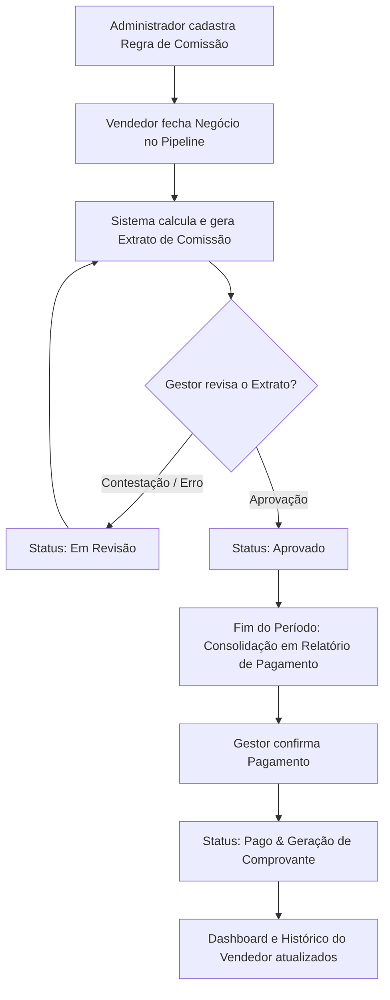

# Gestão de Comissões — Especificação de Frontend e APIs Futuras

Este documento define o planejamento de arquitetura, fluxo de telas, estruturas de dados e contratos de API (Mock) para o novo módulo de **Gestão de Comissões** da plataforma LemeAI.

---

## 1. Visão Geral do Fluxo

A gestão de comissões automatiza o cálculo de incentivos financeiros para vendedores com base nas vendas registradas no pipeline. O ciclo de vida de uma comissão no sistema segue o fluxo abaixo:



---

## 2. Modelos de Dados (Interfaces TypeScript)

Abaixo estão as interfaces planejadas para o frontend consumir e representar as entidades no sistema:

### 2.1. Regra de Comissão (`CommissionRule`)
Define a regra aplicada para calcular a comissão de uma venda.

```typescript
export interface CommissionRule {
  id: number;
  nome: string;
  tipoComissao: 'percentual' | 'fixo' | 'escalonado';
  
  // Parâmetros de cálculo
  valorPercentual?: number; // Ex: 5 para 5%
  valorFixo?: number;       // Ex: 150.00 por negócio
  
  // Para regras escalonadas por faixa de meta atingida (alinhado com GoalsPage)
  faixasEscalonadas?: Array<{
    percentualMetaMinimo: number; // Ex: 0%, 80%, 100% da meta de faturamento
    percentualMetaMaximo: number; // Ex: 79%, 99%, 150%
    valorAplicado: number;        // Percentual ou valor fixo correspondente
    tipoValor: 'percentual' | 'fixo';
  }>;

  // Filtros/Vínculos de Aplicação (Opcionais)
  produtoId?: number;
  categoriaId?: number;
  usuarioId?: number; // Vendedor específico
  equipeId?: number;  // Equipe específica
  
  ativo: boolean;
  criadoEm: string;
}
```

### 2.2. Extrato de Comissão (`CommissionStatement`)
Gera um extrato para cada venda fechada.

```typescript
export interface CommissionStatement {
  id: number;
  vendaId: number; // ID da Oportunidade/Venda no Pipeline
  vendedorId: number;
  vendedorNome: string;
  valorVenda: number;
  dataVenda: string;
  descricaoVenda: string; // Ex: "Cliente X - Plano Premium"
  
  regraAplicadaId: number;
  regraAplicadaNome: string;
  
  valorCalculado: number;
  status: 'pendente' | 'em_revisao' | 'aprovado' | 'rejeitado' | 'pago';
  motivoRevisao?: string; // Motivo caso o gestor conteste
  
  relatorioPagamentoId?: number; // Vinculado a um fechamento mensal
  dataCalculo: string;
  atualizadoEm: string;
}
```

### 2.3. Relatório de Pagamento (`CommissionPaymentReport`)
Consolidação mensal ou por período de todas as comissões aprovadas para cada vendedor.

```typescript
export interface CommissionPaymentReport {
  id: number;
  vendedorId: number;
  vendedorNome: string;
  periodo: string; // Formato YYYY-MM
  quantidadeVendas: number;
  valorTotalVendas: number;
  valorTotalComissao: number;
  status: 'pendente_aprovacao' | 'pronto_para_pagamento' | 'pago';
  comprovanteUrl?: string; // Comprovante de transferência
  pagoEm?: string;
  pagoPorNome?: string;
}
```

---

## 3. Especificação das APIs Futuras (Contratos Mock)

Base URL proposta: `/api/comissao`

### 3.1. Módulo Regras — `/api/comissao/regra`

*   `GET /api/comissao/regra` — Retorna todas as regras de comissão cadastradas.
*   `GET /api/comissao/regra/{id}` — Busca uma regra por ID.
*   `POST /api/comissao/regra` — Cadastra uma nova regra.
*   `PUT /api/comissao/regra/{id}` — Atualiza uma regra existente.
*   `DELETE /api/comissao/regra/{id}` — Inativa ou exclui uma regra.

### 3.2. Módulo Extratos — `/api/comissao/extrato`

*   `GET /api/comissao/extrato` — Retorna extratos detalhados com filtros de `vendedorId`, `periodo` e `status`.
*   `PUT /api/comissao/extrato/{id}/status` — Atualiza o status do extrato (Aprova, contesta para revisão ou rejeita).
    ```json
    // Payload Exemplo: Contestar
    {
      "status": "em_revisao",
      "motivoRevisao": "Venda cancelada pelo cliente no mesmo dia"
    }
    ```

### 3.3. Módulo Pagamentos — `/api/comissao/pagamento`

*   `GET /api/comissao/pagamento` — Busca relatórios consolidados por período.
*   `POST /api/comissao/pagamento/consolidar` — Gera a consolidação do período para todos os vendedores.
*   `POST /api/comissao/pagamento/{id}/confirmar` — Registra o pagamento do relatório anexando opcionalmente o comprovante.

---

## 4. Organização do Frontend e Telas Sugeridas

Conforme a estrutura do menu de navegação da plataforma, a organização de telas do módulo de comissões será dividida em duas áreas principais:

### 4.1. Configuração de Regras — Ajustes > Gestão de Acesso
Como o cadastro e a parametrização das regras de comissão são tarefas puramente administrativas e de configuração de políticas comerciais, este item ficará sob o menu **Ajustes > Gestão de Acesso** (ao lado de Usuários, Equipes e Metas).

*   **Rota**: `/ajustes/comissao-regras`
*   **O que contém**:
    *   **Tabela de Regras**: Lista com todas as regras cadastradas (ativas e inativas).
    *   **Modal de Criação/Edição**:
        *   Tipo de vínculo (Produto, Categoria, Vendedor específico ou Geral).
        *   Modo de cálculo (Percentual fixo, Valor monetário fixo ou Faixa escalonada baseada na meta de faturamento obtida da `GoalsPage`).
        *   Status de ativação.

### 4.2. Painel Operacional — Novo Menu Lateral "Comissões"
Um novo menu principal de primeiro nível chamado **Comissões** (representado por um ícone financeiro, ex: `FaDollarSign` ou `FaPercentage`) será adicionado à barra lateral. Este menu será a central de acompanhamento financeiro diário e fechamentos.

A exibição nesta página será adaptável de acordo com o nível de acesso do usuário logado:

#### A) Visão do Gestor / Financeiro
Se o usuário logado tiver perfil de gestão/administração, a página do menu "Comissões" conterá 3 abas principais:

1.  **Dashboard e Visão Geral**:
    *   Cards com KPIs: Comissão pendente de aprovação, Comissão aprovada (pronta para pagamento), Total acumulado pago no período selecionado.
    *   Gráfico simples demonstrando a relação Faturamento Operacional vs. Despesa com Comissões.
2.  **Fluxo de Aprovação (Extratos)**:
    *   Lista de todos os extratos de comissão calculados automaticamente quando vendas são movidas para "Fechada" no pipeline.
    *   Ações de **[Aprovar]** e **[Contestar]** (que coloca o extrato em revisão e abre campo de feedback/ajuste).
3.  **Fechamento e Lançamento de Pagamento**:
    *   Consolidador mensal: agrupa todas as comissões aprovadas por vendedor em uma única linha de pagamento.
    *   Ação de **[Confirmar Pagamento]**: permite registrar o pagamento de cada vendedor e fazer o upload do comprovante Pix/TED.

#### B) Visão do Vendedor (Colaborador)
Se o usuário logado for um vendedor, ele acessa o menu "Comissões" e vê um painel exclusivo focado nos seus próprios resultados e na transparência do seu bolso:

1.  **Visão Consolidada**:
    *   Painel resumido com o valor que ele tem para receber (aprovado), valor que ainda está em análise e o total pago histórico.
2.  **Histórico e Extrato Pessoal**:
    *   Visualização de cada uma de suas vendas, qual regra foi aplicada pelo sistema, qual o status de aprovação de cada item e o motivo detalhado caso o gestor tenha aberto alguma contestação.
3.  **Comprovantes e Recibos**:
    *   Acesso para baixar os comprovantes bancários anexados pelo financeiro no dia do fechamento.

---

## 5. Estratégias de Integração com o Sistema Existente

### 5.1. Conexão com o Pipeline (Venda Fechada)
Atualmente, quando uma conversa ou oportunidade no Kanban muda para o status final ("Fechada"/"Venda Fechada"), podemos disparar um hook/event handler no frontend (ou futuramente no backend) para:
1. Buscar o vendedor associado à oportunidade.
2. Identificar a regra mais específica aplicável (Vendedor > Produto > Geral).
3. Calcular o valor da comissão.
4. Gravar o extrato com status `pendente`.

### 5.2. Integração com a `GoalsPage` (Metas)
*   **Cálculo Escalonado**: Para calcular regras do tipo `escalonado`, o sistema irá ler a meta de faturamento cadastrada para aquele vendedor no mês de referência (usando o endpoint `/api/relatorio/PerformanceIndividual` ou `/api/meta/BuscarTodas`).
*   **Visualização de Metas**: Adicionar um indicador visual diretamente na tabela de metas da `GoalsPage` mostrando a "Comissão Estimada Acumulada" ao lado do faturamento realizado de cada vendedor.
